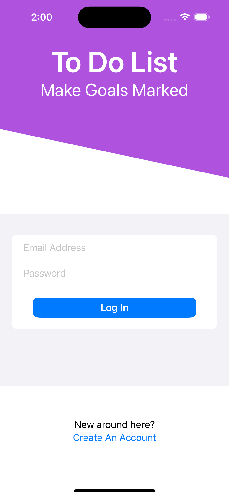
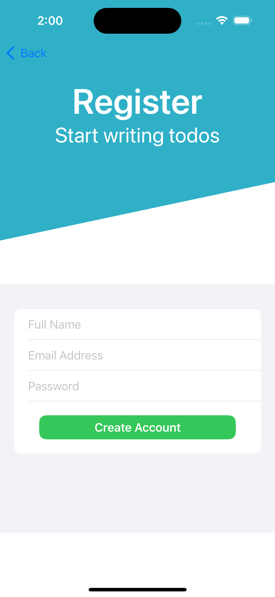
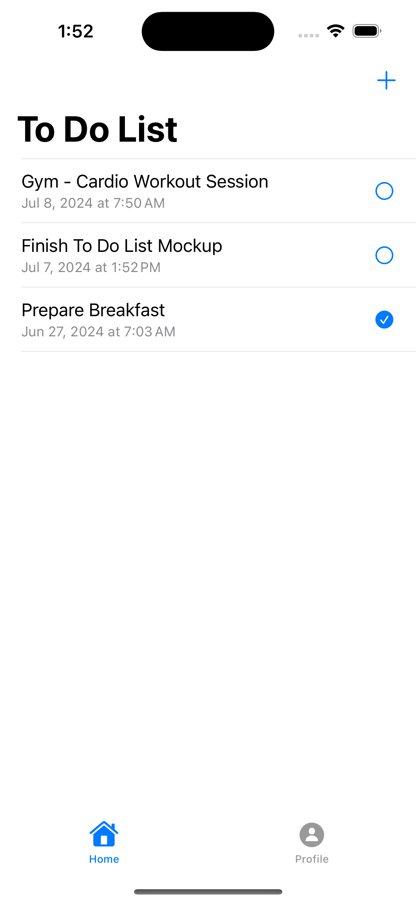
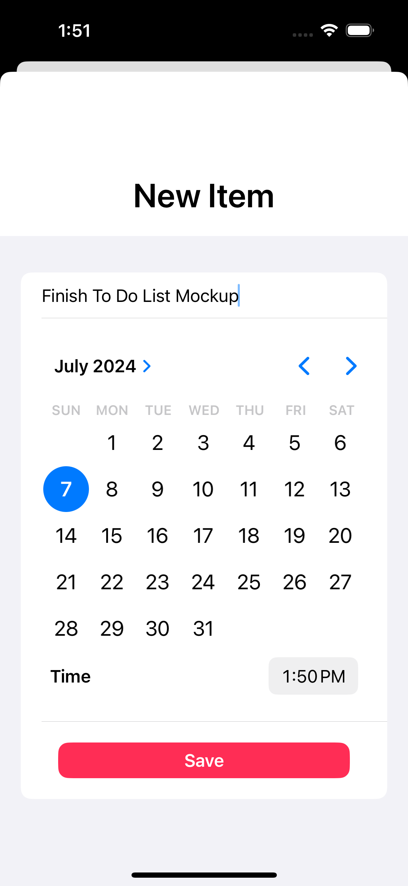

# ToDoList

A simple and intuitive To-Do List application built with Swift for iOS. This app allows users to manage their tasks efficiently by adding, deleting, and marking tasks as complete.

## Screenshots

Login Page           |  Register Page | List Page           |  New Item Page 
:-------------------------:|:-------------------------:|:-------------------------:|:-------------------------:
  |     |   |  

## Features

- Add new tasks
- Delete tasks
- Mark tasks as complete or incomplete
- Persistent storage of tasks

## Requirements

- Xcode 11.0 or later
- iOS 13.0 or later

## Installation

1. Clone the repository:

   ```bash
   git clone https://github.com/aashraybavisa/ToDoList.git
   ```

2. Open the project in Xcode:

   ```bash
   cd ToDoList
   open ToDoList.xcodeproj
   ```

3. Build and run the project in the simulator or on your device.

## Usage

1. Launch the app.
2. Use the '+' button to add a new task.
3. Swipe left on a task to delete it.
4. Tap on a task to mark it as complete or incomplete.

## Contributing

Contributions are welcome! Please create a pull request with a detailed description of your changes.

## License

This project is licensed under the MIT License. See the `LICENSE` file for more details.

## Acknowledgements
- [Afraz Siddiqui](https://www.linkedin.com/in/afrazsiddiqui/)

--> Developed by [Aashray Bavisa](https://www.linkedin.com/in/aashray-bavisa/).
